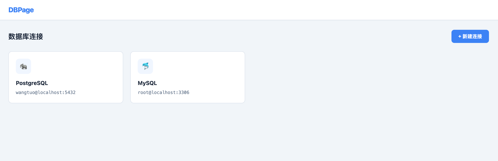
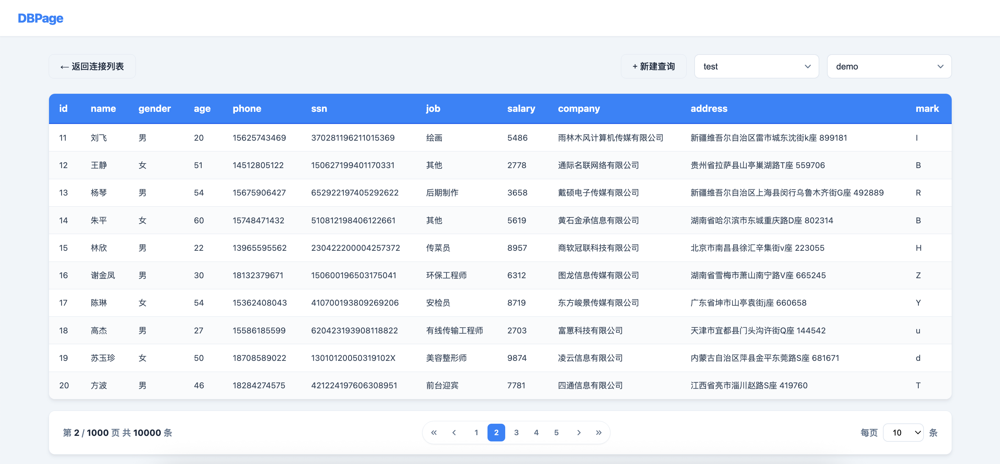
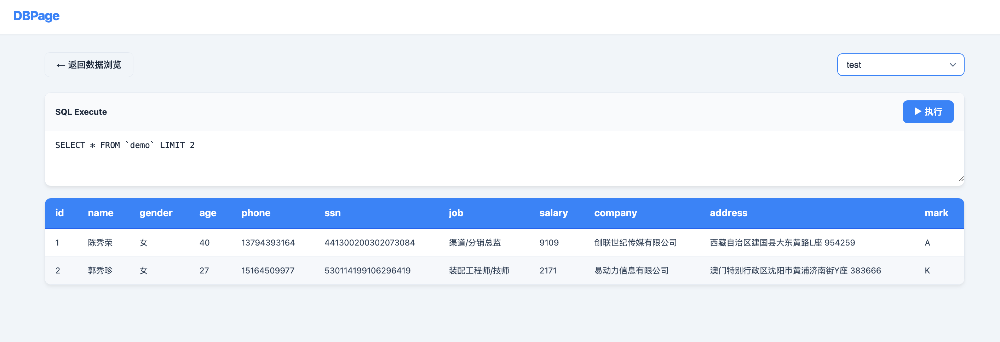

# 🗃️ DBPage

<p align="center">
  
</p>

<p align="center">
  <a href="#"></a>
  <a href="#"></a>
  <a href="#"></a>
  <a href="#"></a>
</p>

> 一个基于 FastAPI 的轻量级数据库数据可视化工具，支持 PostgreSQL 🐘 和 MySQL 🐬。通过 Web 界面管理数据库连接、浏览表数据、执行 SQL 查询，无需登录，开箱即用。

---

## ✨ 功能特性

- 🔌 **连接管理** — 卡片式展示数据库连接，支持新增、编辑、删除
- 🗄️ **多数据库支持** — 同时支持 PostgreSQL 和 MySQL
- 📊 **数据浏览** — 选择数据库和表后分页展示数据，支持调整每页条数
- 📝 **SQL 执行** — 独立的 SQL 查询页面，支持执行任意 SQL 并查看结果
- 💾 **状态持久化** — 每个连接独立保存上次浏览的数据库、表和 SQL 历史，刷新页面后自动恢复
- 🎨 **蓝色主题** — 简洁现代的 UI 设计

---

## 🛠️ 技术栈

| 层级            | 技术                         |
| --------------- | ---------------------------- |
| 后端            | Python + FastAPI             |
| 前端            | 原生 HTML + CSS + JavaScript |
| PostgreSQL 驱动 | `psycopg2`                   |
| MySQL 驱动      | `pymysql`                    |

---

## 📁 项目结构

```
DBPage/
├── 📄 main.py              # FastAPI 后端主文件
├── 📄 requirements.txt     # Python 依赖
├── 📄 start.sh             # 一键启动脚本
├── 📁 templates/
│   └── 📄 index.html       # 主页面模板
├── 📁 static/
│   ├── 📁 css/
│   │   └── 📄 style.css    # 样式文件
│   └── 📁 js/
│       └── 📄 app.js       # 前端逻辑
├── 🖼️ dbpage-home.png
├── 🖼️ dbpage-view-data.png
├── 🖼️ dbpage-exec-sql.png
└── 📄 README.md
```

---

## 🚀 快速开始

### 1. 克隆项目

```bash
git clone <仓库地址>
cd DBPage
```

### 2. 启动服务

```bash
chmod +x start.sh
./start.sh
```

> `start.sh` 会自动创建虚拟环境、安装依赖并启动服务。

### 3. 访问应用

打开浏览器访问 👉 `http://localhost:12399`

---

## 📸 使用指南

### 🔌 添加数据库连接

1. 点击右上角「➕ 新建连接」
2. 填写连接名称、类型、主机、端口、用户名、密码
3. 点击保存


### 📊 浏览数据

1. 在连接卡片页面，点击任意连接卡片进入数据浏览
2. 从下拉框选择数据库和表
3. 数据会自动加载并分页展示
4. 可调整每页显示条数（10 / 20 / 50 / 100 / 500）



### 📝 执行 SQL

1. 在数据浏览页面点击「➕ 新建查询」进入 SQL 页面
2. 选择目标数据库
3. 输入 SQL 语句（如 `SELECT * FROM table_name LIMIT 10`）
4. 点击「▶ 执行」查看结果



---

## ⚙️ 配置说明

### 📄 init.json

首次启动时会自动生成 `init.json`，用于存储连接配置和历史状态：

```json
{
  "connections": [
    {
      "id": "default",
      "name": "PostgreSQL",
      "type": "postgresql",
      "host": "localhost",
      "port": 5432,
      "user": "username",
      "password": "password"
    }
  ],
  "states": {
    "default": {
      "db": "database_name",
      "table": "table_name",
      "sql": "SELECT * FROM table_name LIMIT 10"
    }
  }
}
```

> ⚠️ **注意**：`init.json` 包含敏感信息（密码），请勿提交到版本控制！

---

## ⚠️ 注意事项

- 项目使用 `SessionMiddleware` 存储当前连接状态，依赖浏览器 Cookie
- SQL 执行时请注意操作安全，目前未做权限限制
- 建议仅在本地或受信任的网络环境使用 🔒

---

## 📄 License

[MIT](LICENSE)
